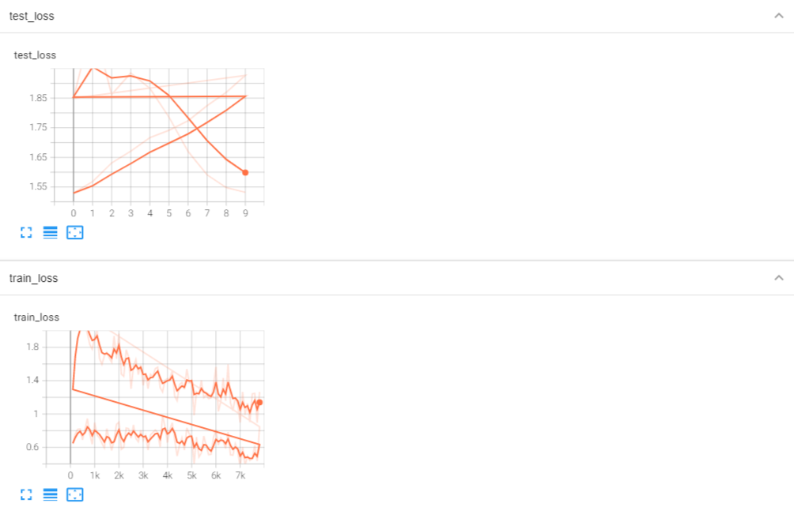

# 模型训练套路2

## 评估模型训练程度

**每次训练完之后 将模型使用测试数据集跑一边  计算损失**

```py

#  设置训练网络的一些参数
total_train_step = 0
# 记录测试的次数
total_test_step = 0

# 训练的轮数
epoch = 10


for i in range(epoch):
    print("------第{}轮训练开始".format(i + 1))

    # 训练步骤开始
    for data in train_dataloader:
        imgs,targets = data

        # 64 x 10
        outputs = tudui.forward(imgs)

        #  计算损失
        loss = loss_fn(outputs,targets)

        #  将梯度清0
        optimizer.zero_grad()

        # 反向传播  计算梯度
        loss.backward()

        # 优化
        optimizer.step()

        #  统计训练次数
        total_train_step = total_train_step + 1

        if total_train_step % 100 == 0:
            # item 将tensor转换为一个数据类型

            print("训练次数:{},Loss:{}".format(total_train_step,loss.item()))
    
    #  测试步骤开始
    total_test_loss = 0
    with torch.no_grad():

        #  取出测试数据集的数据
        for data in test_dataloader:

            #  取出数据
            imgs,targets = data
            outputs = tudui(imgs)

            loss = loss_fn(outputs,targets) # 计算损失


            #  统计测试集上面的总损失
            total_test_loss = total_test_loss + loss.item()


    print("整体测试集上面的Loss:{}".format(total_test_loss))
```


## 使用tensorboard展示训练损失和测试损失变化曲线

**使用tensorboard将损失和训练次数的曲线展示出来**

**绘制训练损失曲线和测试损失曲线**

  

```py

#  设置训练网络的一些参数
total_train_step = 0
# 记录测试的次数
total_test_step = 0

# 训练的轮数
epoch = 10
from torch.utils.tensorboard import SummaryWriter

#  添加tensorboard

writer = SummaryWriter("../logs_train")

for i in range(epoch):
    print("------第{}轮训练开始".format(i + 1))

    # 训练步骤开始
    for data in train_dataloader:
        imgs,targets = data

        # 64 x 10
        outputs = tudui.forward(imgs)

        #  计算损失
        loss = loss_fn(outputs,targets)

        #  将梯度清0
        optimizer.zero_grad()

        # 反向传播  计算梯度
        loss.backward()

        # 优化
        optimizer.step()

        #  统计训练次数
        total_train_step = total_train_step + 1

        if total_train_step % 100 == 0:
            # item 将tensor转换为一个数据类型

            print("训练次数:{},Loss:{}".format(total_train_step,loss.item()))

            #  绘制训练损失
            writer.add_scalar("train_loss",loss.item(),total_train_step)
    #  测试步骤开始
    total_test_loss = 0
    with torch.no_grad():

        #  取出测试数据集的数据
        for data in test_dataloader:

            #  取出数据
            imgs,targets = data
            outputs = tudui(imgs)

            loss = loss_fn(outputs,targets) # 计算损失


            #  统计测试集上面的总损失
            total_test_loss = total_test_loss + loss.item()


    print("整体测试集上面的Loss:{}".format(total_test_loss))
    writer.add_scalar("test_loss",loss.item(),total_test_step)
    total_test_step = total_test_step + 1

```


## 计算正确率

**使用argmax计算索引**

  


```py

#  设置训练网络的一些参数
total_train_step = 0
# 记录测试的次数
total_test_step = 0

# 训练的轮数
epoch = 10
from torch.utils.tensorboard import SummaryWriter

#  添加tensorboard

writer = SummaryWriter("../logs_train")

for i in range(epoch):
    print("------第{}轮训练开始".format(i + 1))

    # 训练步骤开始
    tudui.train()
    for data in train_dataloader:
        imgs,targets = data

        # 64 x 10
        outputs = tudui.forward(imgs)

        #  计算损失
        loss = loss_fn(outputs,targets)

        #  将梯度清0
        optimizer.zero_grad()

        # 反向传播  计算梯度
        loss.backward()

        # 优化
        optimizer.step()

        #  统计训练次数
        total_train_step = total_train_step + 1

        if total_train_step % 100 == 0:
            # item 将tensor转换为一个数据类型
            print("训练次数:{},Loss:{}".format(total_train_step,loss.item()))
            #  绘制训练损失
            writer.add_scalar("train_loss",loss.item(),total_train_step)

    #  测试步骤开始
    tudui.eval()
    total_test_loss = 0
    total_accuracy = 0
    with torch.no_grad():

        #  取出测试数据集的数据
        for data in test_dataloader:

            #  取出数据
            imgs,targets = data
            outputs = tudui(imgs)

            loss = loss_fn(outputs,targets) # 计算损失

            #  统计测试集上面的总损失
            total_test_loss = total_test_loss + loss.item()
            accuracy = (outputs.argmax(1) == targets).sum()
            total_accuracy = total_accuracy + accuracy


    print("整体测试集上面的Loss:{}".format(total_test_loss))
    print("整体测试及上面的正确率:{}".format(total_accuracy / test_data_size))
    writer.add_scalar("test_loss",loss.item(),total_test_step)
    writer.add_scalar("test_accuracy",total_accuracy / test_data_size,total_test_step)
    total_test_step = total_test_step + 1

```


