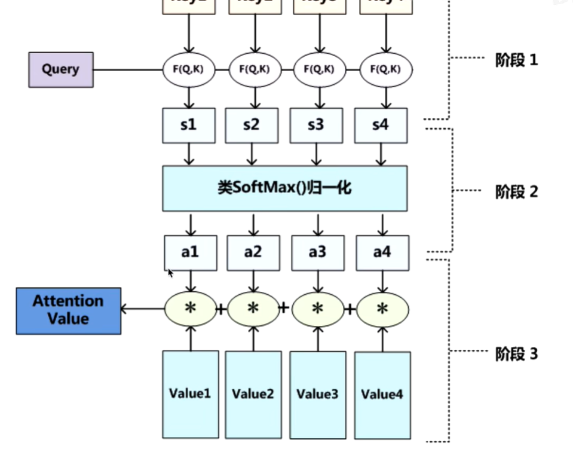
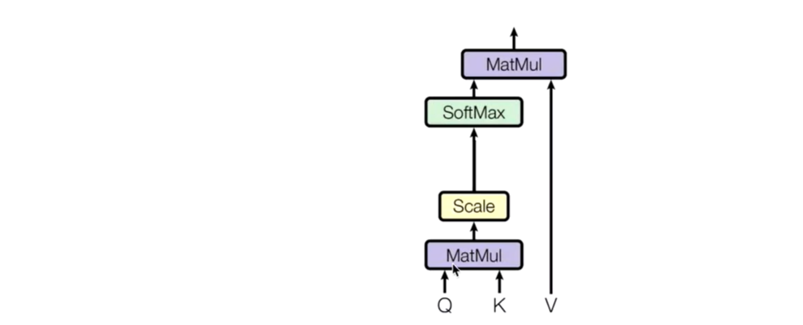
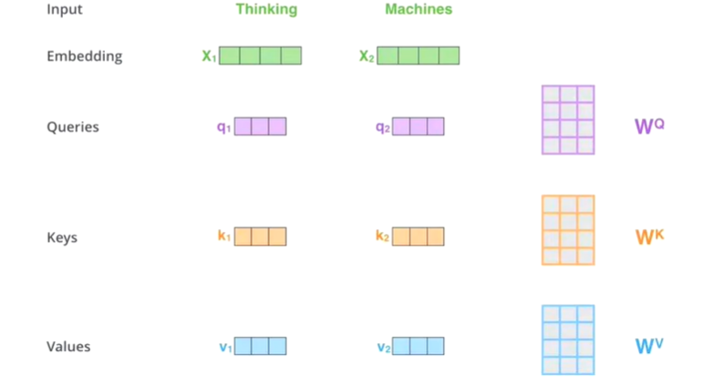
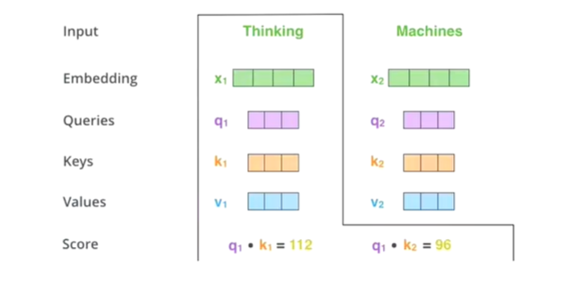
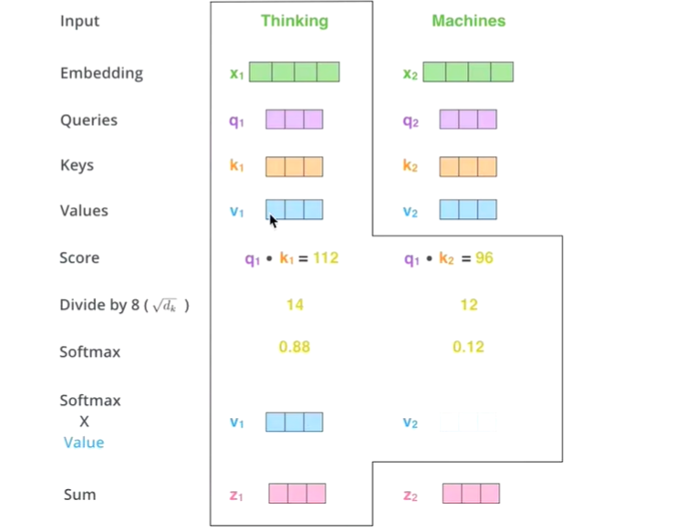
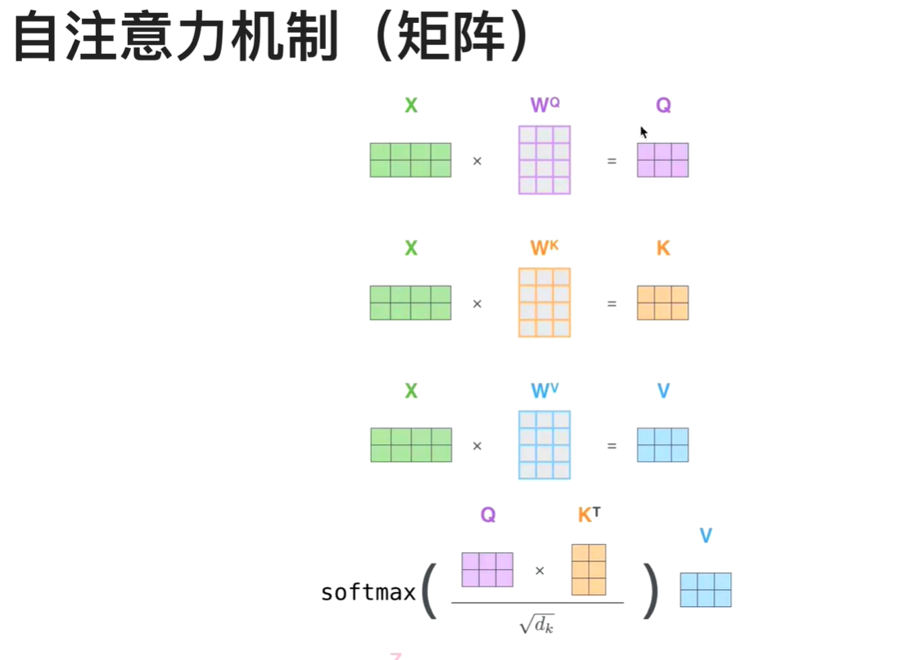
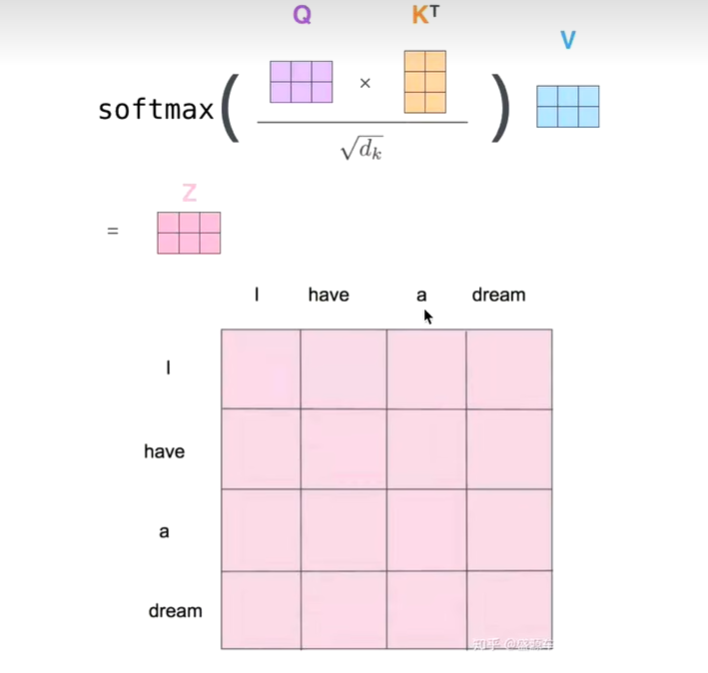

# 注意力机制的快速学习

## 注意力机制

&emsp;将焦点聚焦在比较重要的事物上

* 我（查询对象Q），这张图（被查询对象V）

* 我看一张图，第一眼，就会判断那些东西对我而言比较重要，那些对于我不重要（去计算Q和V之间的事物重要度）

* 重要度计算，其实就是计算相似度（更接近），点乘其实就是计算内积

* Q，K = k1,k2,k3...kn,我们一般使用点乘方式

* 通过点乘的方法计算Q和K里面的每一个事物的相似度，就可以拿到Q和k1的相似度s1,Q和k2的相似度s2,... 相似度sn

* 最后，softmax(s1,s2,...,sn)就可以得到概率(a1,a2,..,an)，然后就知道那个更加重要

  

* 原先的V = （v1,v2,vn）

* 最后进行一个汇总，当使用Q查询结束之后，Q已经失去它的使用价值，最后还是需要使用这张图片，但是现在的这张图片多了一些信息

* （a1,a2,an）* (v1,v2,vn) = (a1*v1,a2*v2...)
* 这样就得到一个新的V，新的V就包含了哪些更重要的信息，那些不重要的信息
* 使用新的V代替原来的V

## 自注意力机制

* 第一眼看一张图，不会把所有的信息都看完

  

* QK相乘计算相似度，然后做一个scale（后面softmax的时候避免极端情况）
* softmax得到概率

* 自注意力机制的关键点在于，不仅仅是K=V=Q 来源于同一个X,三者是同一个源头

  

* Q KV 的获取是通过三个参数Wq,  Wk,Wv进行矩阵相乘得到的
* 接下来的步骤和注意力机制一样

  

  

* z1就是达标thinking的新的向量表示

  

  

