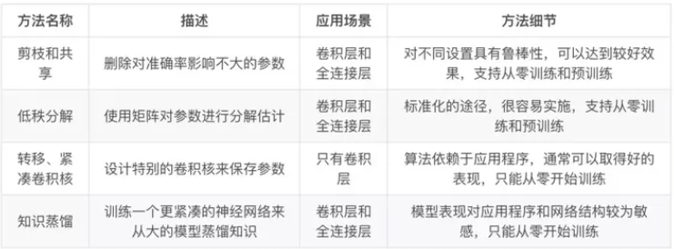
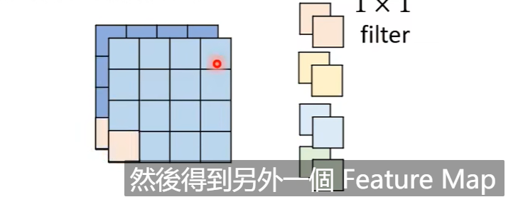

# 神经网络压缩调研

## 背景

&emsp;小模型，参数少，容易将ML模型部署在资源有限的设备上，但是直接训练一个好的小网络比较困难

## 现有的深度模型压缩方法

* 基于参数修建和共享的方法针对模型参数的冗余性  试图取出冗余和不重要的项
* 基于低秩因子分解的技术使用矩阵/张量分解来估计深度学习模型的信息参数
* 基于传输/紧凑卷积滤波器的方法设计页数的卷积滤波器来降低存储和计算复杂度
* 知识蒸馏方法通过学习一个蒸馏模型，训练一个更紧凑的神经网络来重现一个更大的网络输出

综述论文 :A Survey of Model Compression and Acceleration for Deep Neural Networks

  

* 转移层和参数修剪和共享可以一起使用
* 模型量化和二值化可以与低秩近似一起使用以实现进一步的加速

## NetWork Prunning 网络剪枝

&emsp;删减神经网络没有用的参数

* 过程如下（PPT）叙述一遍
* 训练一个网络
* 针对网络的每一个参数评估一下重要性  每一个神经元的重要性
* 移除不重要的参数或者神经元
* 微调 重新训练一下 Fine-tune
* 反复进行多次

  

**修剪的单位 参数或者神经元**

* 移除若干个权重参数，但是实际操作不好定义 因为结构不对称,而且当Network不规则，不方便使用GPU进行加速
* 评价weight重要性，我们可以用绝对值衡量，即绝对值越大，weight越重要，或者采用之前介绍的life long learning的想法
* 评价neuron重要性，我们可以用其输出的结果为0的次数衡量，即输出0越多越不重要。

  

* neuron pruning
一神经元为单位进行剪枝，通过去除冗余的神经元，简化网络结构。这样得到的网络结构是规则的，相比于Weight pruning，这种方式更好实现，也更容易通过GPU加速。

  

**训练一个大的模型，保留比较有用的模型参数 然后得到一个小的模型，这样得到的小模型效果和原始的大模型效果差不多，而不是直接训练一个小的模型**

  

## 设计结构化矩阵

&emsp;如果一个Mxn矩阵可以使用一个少于mxn的参数来描述，就是一个结构化的矩阵，通常这样的结构不仅能减少内存消耗，还可以通过快速的矩阵-向量乘法和梯度计算显著加快推理和训练的速度

&emsp;但是问题是结构的约束会导致精确度的损失，因为约束可能给模型带来偏差，另外一个方面如何找到一个合适的矩阵结构是很困难的，没有理论来支持推导。

## 知识蒸馏

&emsp;首先定义一个比较大的网络Teacher Net,然后训练，那么训练后的网络，比如手写数字识别任务，预测1的结果概率是 1：0.7 7：0.2 9：0.1，在定义一个小的网络Student Net ，然后让他学习Teacher Net，如果让比较小的网络得到和比较大的网络一样的效果比较难train,所以直接按照大的network的训练结果训练小的网络，跟容易train。

  

这个Teacher Net不一定是一个巨大的network，也有可能是将多个network组合（ensemble）得到的。但是多个network组合的模型往往比较复杂，在实际应用中，我们可以训练一个Student Net，让结果逼近N Networks的结果，使得模型准确度差不多的情况下，复杂度大大减少。

**关于只是蒸馏的一个小技巧，就算是在softmax函数的基础上对每一个输出的结果加上一个temperature，这样会对最后最后的预测结果进行一个平滑的处理，使得Student Net更好训练**

&emsp;基于知识蒸馏方法可以令更深的模型降低计算成本，但是只能用于具有Softmax损失函数分类任务，这阻碍应用，但是另一个缺点是太严格，性能比不上其他方法，老师和学生可以是不同的网络结构，比如BERT蒸馏到BiLSTM网络，但是一般相似网络结构，蒸馏的效果会更好。

## 权值共享

&emsp;ALBert,十二层共用一套参数，从而使得参数量降低到原来的1/12.这个方案对于模型压缩得作用很大，但是对于推理加速则收效甚微，因为共享权值并没有带来计算量得减少

## Parameter Quantization（参数量化）

&emsp;参数量化，称之为参数压缩，这种方法主要是对weigth在存储量上减少的一类方法，

* 对于weight的精度可能不需要太高就可以获得一个比较好的效果，比如从64->32  其实就是减少减少数据的存储位数

* 权重聚类：将神经网络所有的weight按照值得大小进行划分，数值差不多的聚集在一起，然后对每一个类取一个值，替换里面所有的权值，相当于每一个堆只用一个值就可以存储，这样存储得数据量大大减少

* 采用哈夫曼编码，比较常见得东西使用比较少的bit描述，不常见得东西使用比较多得bit描述，但是平均起来存储得数据量大大减少。

  

## 量化和二进制化

  

&emsp;网络量化通过减少表示每一个权重所需要的比特数目来压缩原始网络

* Vanhoucke使用8比特参数量化可以在准确率损失极小的同时实现大幅加速
* Han S提出了一整套完整的深度网络的压缩流程：
* 首先修建不重要的连接，重新训练稀疏连接的网络 
* 然后使用权重共享量化连接的权重，
* **再对量化之后的权重和码本进行霍夫曼编码**，以进一步降低压缩率
* 修剪、量化、和霍夫曼编码

**修建减少了需要编码的权重数量，量化和霍夫曼编码减少了用于对每个权重编码的比特数。对于大部分元素为0的矩阵可以使用稀疏表示，进一步降低空间冗余，且这种压缩机制不会带来任何准确率**

## 伪量化
&emsp;保存模型每一层的时候，使用低精度来保存每一个网络参数，同时保存拉伸比例scale和对应的浮点数zeroPoint,然后在推理阶段，使用如下公式来还原网络参数32bit

  

存储的时候使用低精度进行量化，但是推理的时候还原为正常的高精度，为量化只能实现模型压缩，但是不能加速模型

## Architecture Design（Depth Separable Convolution）

&emsp;CNN减少参数量得结构化设计,深度可分离卷积  PPT 介绍这部分 逐层卷积  逐点卷积

对于CNN，假设输入有两个channel,对应的filter也就是两个channel，假设有四个filter,每一个filter都是3 *3 的,那么输出也有四个channel,卷积层一共包含3 * 3 * 2 * 4 = 72个参数

  

深度可分离卷积：Depthwise Convolution

* 有几个channel 就有几个filter 
* 每一个filter只管一个channel
* 每一个filter在一个channel上进行convolution 卷积操作 生成一个channel
* channel和channel之间的关系没法体现出来

Depthwise Convolution首先经过第一次卷积运算，DW完全是在二维平面内进行。卷积核的数量与上一层的通道数相同（通道和卷积核一一对应）。所以一个三通道的图像经过运算后生成了3个Feature map(如果有same padding则尺寸与输入层相同为5×5)，

  

PointWise Convolution

  

* 每一个filter扫描所有的channel 得到一个新的channel

Pointwise Convolution的运算与常规卷积运算非常相似，它的卷积核的尺寸为 1×1×M，M为上一层的通道数。所以这里的卷积运算会将上一步的map在深度方向上进行加权组合，生成新的Feature map

  

对于深度可分离卷积DepthWise Separable Convolution 使用DepthWise Convolution和 PointWise Convlution 进行结合 ，用来提取特征feature map

相比常规的卷积操作，它的参数数量和运算成本比较低

**神经网络压缩的几种方法，并不是互斥的，可以先使用一个方法，再接着使用剩余的一个或者几个方法，直到满足压缩条件**

## 分解卷积

* 使用两个串联得小卷积核来代替一个大的卷积核。inceptionV2中创造性的提出了两个3x3的卷积核代替一个5x5的卷积核，在效果相同的情况下，参数量仅为原先的3x3x2/5x5 = 18/25
* 使用两个并联的非对称卷积核来代替一个正常卷积核，inceptionV3中将一个7x7的卷积拆分成一个1x7和一个7x1的卷积，卷积效果相同的情况下，大大减少了参数量，同时还提高了卷积的多样性

## 现有的神经网络压缩方法的论文

## 现有的震相拾取网络压缩方法的论文-重点讲解

### LPPN

### EQTransformer

### PhaseNet

**分析PhaseNet的参数量主要聚集在那些层**

### LEQNET

### LCANET

