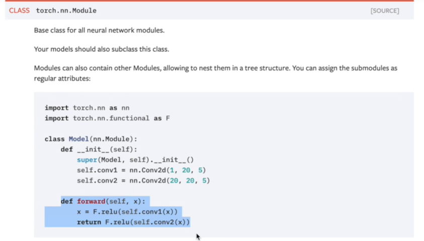
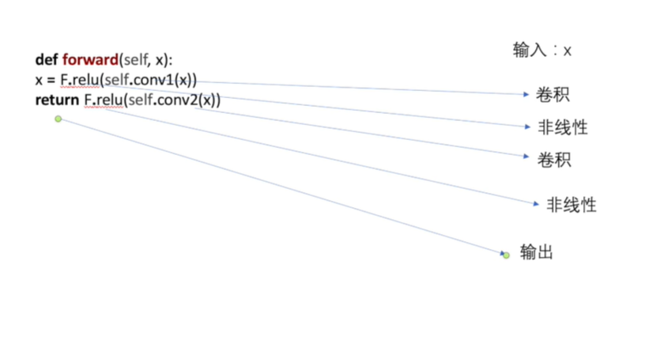
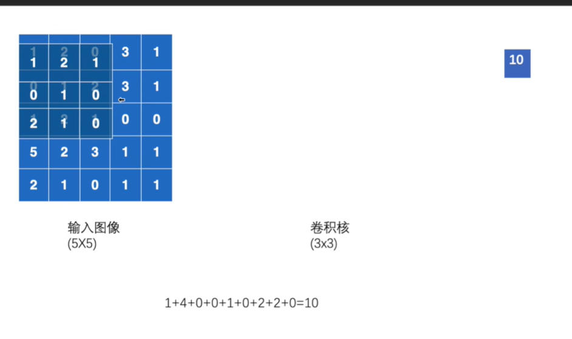
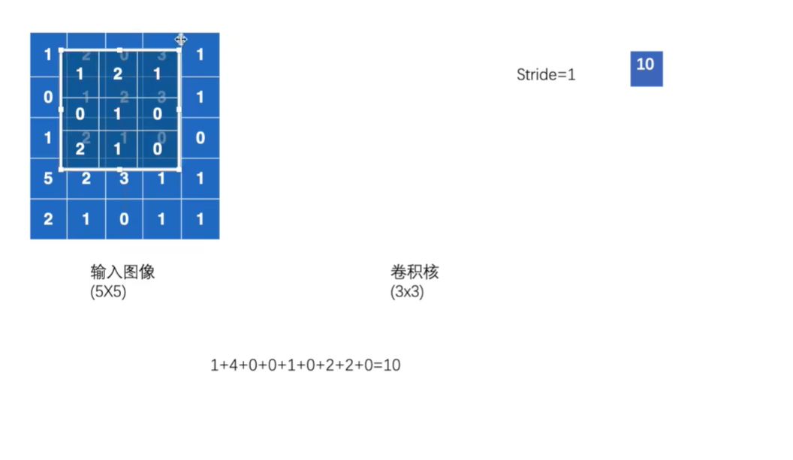
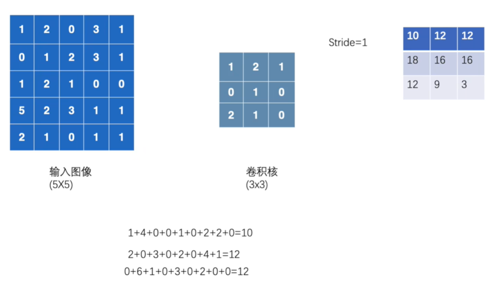
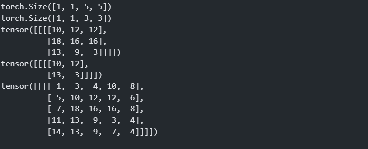
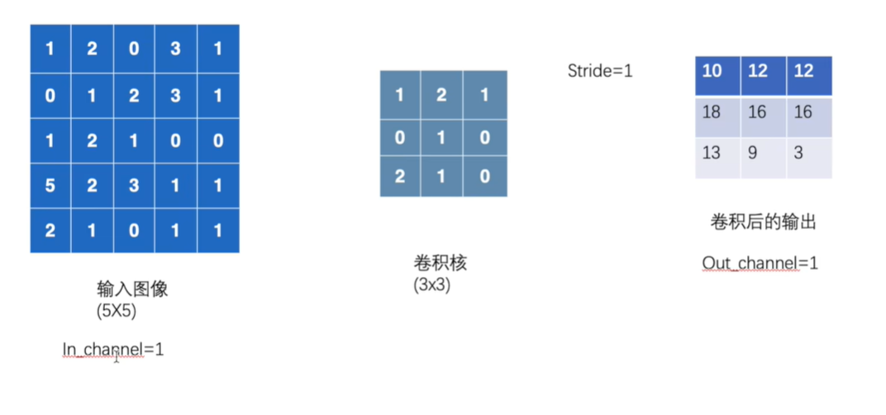
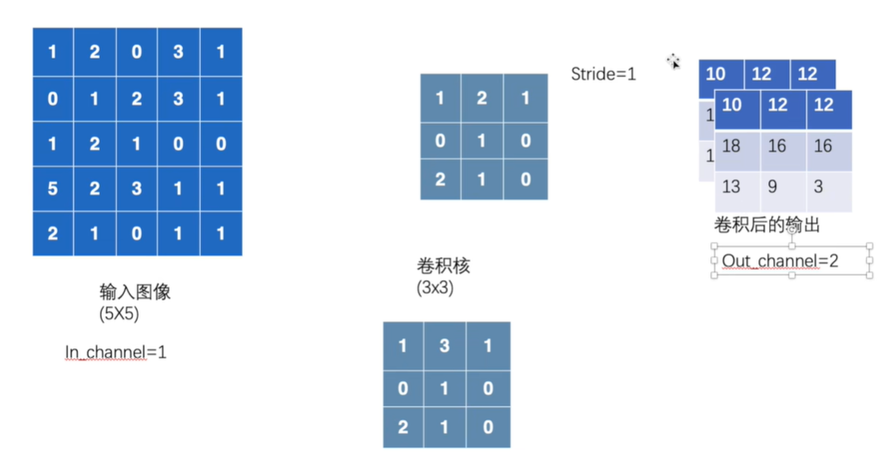
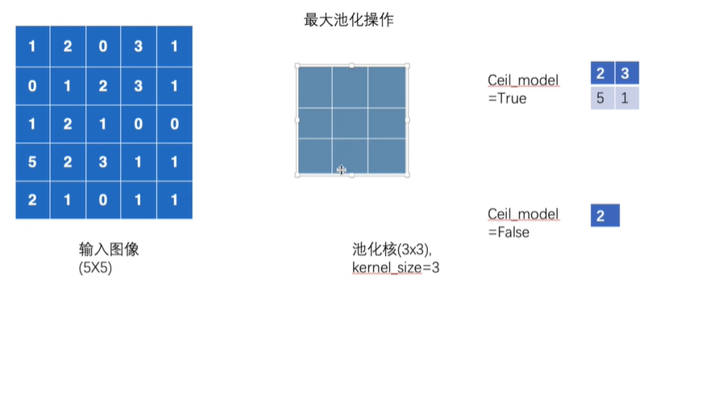

# 神经网络的基本骨架

## nn.module的基本使用

**nn.module是所有神经网络的基本类，其他的所有神经网络都是继承该类，在此基础上进行修改。**

  


  

**上面的forward函数，首先进行卷积操作，然后进行一次非线性操作，然后进行卷积操作，非线性操作**


**module的简单使用**

```py
import torch
from torch import nn

class Tudui(nn.Module):

    #  初始化 父类
    def __init__(self):
        super().__init__()

    def  forward(self,input):
        output = input + 1
        return output
    
tudui  =Tudui()

x = torch.tensor(1.0)
output = tudui.forward(x)

print(output)


```


## 卷积操作

**使用卷积核对输入的图像进行操作**

  

**stride=1 卷积核走一步**

  

**卷积之后的输出**

  

**二维卷积**
```py
import torch

#  导入卷积函数
import torch.nn.functional as F

#  输入二维矩阵 模拟一个图像
input = torch.tensor([[1,2,0,3,1],
                    [0,1,2,3,1],
                    [1,2,1,0,0],
                    [5,2,3,1,1],
                    [2,1,0,1,1]])

# 卷积核
kernel = torch.tensor([[1,2,1],
[0,1,0],
[2,1,0]])

#  batchsize 1 一个channel  5 x 5的图像
input = torch.reshape(input,(1,1,5,5))
kernel = torch.reshape(kernel,(1,1,3,3))

print(input.shape)
print(kernel.shape)


#  进行卷积操作  步长为1
output = F.conv2d(input,kernel,stride = 1)
print(output)


#  卷积步长为2
output = F.conv2d(input,kernel,stride = 2)
print(output)

#  填充1
output = F.conv2d(input,kernel,stride = 1,padding = 1)
print(output)


```

  


## 神经网络卷积层

**一个卷积核**

  

**两个卷积核**
  


* in_channels:输入通道数 由输入图像通道数决定
* out_channels；输出通道数 由卷积核数量进行决定  也代表最终输出通道数
* kernel_size:卷积核大小  控制输出大小
* stride:步长，也控制输出大小

```py
import torchvision
from torch.utils.data import DataLoader
from torch import nn
from torch.nn import Conv2d
from tensorboardX import SummaryWriter
import torch


# 转换成tensor张量形式 下载测试数据集
dataset = torchvision.datasets.CIFAR10("../data",train = False,transform = torchvision.transforms.ToTensor(),download = True)

#  每次取出64长图片
dataloader = DataLoader(dataset,batch_size = 64)


class Tudui(nn.Module):
    def __init__(self):
        super(Tudui,self).__init__()
        #  6个卷积核 n x n

        #  比如图片是3 x 3的 使用6 个 3 x 3的卷积核进行卷积操作  得到6个输出  每一个卷积核不一样
        self.conv1 = Conv2d(in_channels = 3,out_channels=6,kernel_size=3,stride =1,padding=0)

    #  前向传播
    def forward(self,x):
        x = self.conv1(x)
        return x


tudui = Tudui()
print(tudui)


writer = SummaryWriter("../logs")

step = 0

for data in dataloader:
    imgs,targets = data # 拆分元组
    output = tudui.forward(imgs)

    #  打印原始大小 64 3 32 32
    print(imgs.shape)

    #  每次取出64张图片  每张图片原本是3个channel 经过卷积操作变成6个channel  每张图片都是30 x 30大小
    print(output.shape)

    writer.add_images("input",imgs,step)

    #  对output 进行一次reshape 然后进行显示 64 6 30 30  -》 ？3 30 30  将图片转换成三通道
    output = torch.reshape(output,(-1,3,30,30))
    writer.add_images("output",output,step)

    step = step + 1


```


## 最大池化的使用-池化层

**每次取出卷积核范围内最大的那个数字**

**如果cell_model = true表示图像中的数字不足以覆盖卷积核 仍然取出最大值**

  

**Input: N C H W N 代表batchsize  C代表通道数**

```py
import torch
from torch import nn
from torch.nn import MaxPool2d


input  = torch.tensor([[1,2,0,3,1],
                       [0,1,2,3,1],
                       [1,2,1,0,0],
                      [5,2,3,1,1],
                      [2,1,0,1,1]],dtype=torch.float32)

#  改变tensor的形状
input = torch.reshape(input,(-1,1,5,5))

print(input.shape)

class Tudui(nn.Module):
    def __init__(self):
        super(Tudui,self).__init__()
        #  定义池化操作 最大卷积操作
        self.maxpool1 = MaxPool2d(kernel_size = 3,ceil_mode = True)

    #  前向传播
    def forward(self,input):
        output = self.maxpool1(input)
        return output
    
tudui = Tudui()
#  前向传播
output = tudui.forward(input)
print(output)


```


