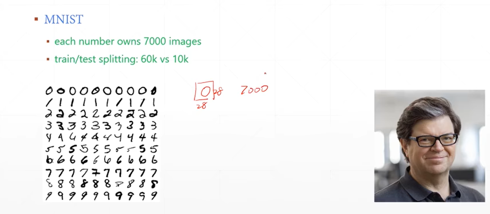

# 简单回归问题

## 线性回归添加噪声

  


**使用均方差损失函数来衡量损失**

## 简单例子

  

**通过最小化损失函数，求解出参数w b**

**下图表示搜索最小的Loss**

  

**给出一系列的样本方程，然后训练出一个模型参数w b使得可以预测**
  


## 分类问题引入-手写数字识别

### 数据集

**7000张照片 6000张训练 1000张测试**
  


## 训练推导

**首先将一张28 * 28的照片展平 784，然后插入一个维度表示[1,784]**

**关于推导过程**

  

**使用one-hot编码对输出的结果进行编码**

  

**计算loss**

**这里的Loss计算很简单，直接使用输出的H3向量和标签向量做减法 然后求平方**

  

**也就是优化预测值和真实值的欧氏距离**
  

**ReLU函数的非线性增强**
  

**输出的预测值，是一个一维向量，里面包含每一种类别的预测值，然后去除概率最大的索引**
  

## 手写数字识别1

### 加载数据集

```py
from torch import nn
from torch.nn import functional as F
from torch import optim
import torchvision
from matplotlib import pyplot as plt


#  加载数据集  batch_size表示每次取出512张图片
batch_size = 512
#  torchvision.transforms.Normalize((0.1307,),(0.3081,)) 表示归一化操作
# torchvision.transforms.ToTensor() 表示将numpy张量 转换为tensor
train_loader = torch.utils.data.DataLoader(torchvision.datasets.MNIST('minst_data',
                                                                      train = True,
                                                                      download=True,
                                                                      transform=torchvision.transforms.
                                                                      Compose([torchvision.transforms.ToTensor(),
                                                                               torchvision.transforms.Normalize((0.1307,),(0.3081,))])),
                                                                               batch_size=batch_size,shuffle = True)


#  加载测试数据集
train_loader = torch.utils.data.DataLoader(torchvision.datasets.MNIST('minst_data',
                                                                      train = False,
                                                                      download=True,
                                                                      transform=torchvision.transforms.
                                                                      Compose([torchvision.transforms.ToTensor(),
                                                                               torchvision.transforms.Normalize((0.1307,),(0.3081,))])),
                                                                               batch_size=batch_size,shuffle = False)

```

### 编写网络

```py
#  编写网络
class Net(nn.Module):
    def __init__(self):
        super(Net,self).__init__()

        # xw + b
        self.fc1 = nn.Linear(28 * 28,256)
        self.fc2 = nn.Linear(256,64)
        self.fc3 == nn.Linear(64,10)

    def forward(self,x):
        x = F.relu(self.fc1(x))
        x = F.relu(self.fc2(x))
        x = self.fc3(x)

        return x
    

```


### 训练网络

```py
net = Net()
# 定义优化器
optimizer = optim.SGD(net.parameters(),lr = 0.01,momentum=0.9)

# 保存训练损失
train_loss = []
for epoch in range(3):
    for batch_idx,(x,y) in enumerate(train_loader):
        #  将 [b,1,28,28] 转换成 [b.feature] 二维的tensor

        x = x.view(x.size(0),28 * 28) # 第一个参数表示图片的batch_size  

        # 最后的out形状是 [b,10] 表示每一张图片有 十个类别的概率
        out = net(x)

        # 转换为独热编码
        y_onehot = one_hot(y)

        # 计算损失
        loss = F.mse_loss(out,y_onehot)

        # 梯度清零
        optimizer.zero_grad()

        # 计算梯度
        loss.backward()

        # 更新优化
        optimizer.step()

        train_loss.append(loss.item())

        if batch_idx % 10 ==0:
            print("第{}次迭代的损失是{}".format(epoch,loss.item()))
```

  


### 计算正确率

```py
total_correct = 0

# 计算正确率
for x,y in test_loader:
    x = x.view(x.size(0),28 * 28)
    out = net(x)
    pred = out.argmax(dim = 1)
    correct = pred.eq(y).sum().float().item()
    total_correct += correct

total_num  = len(test_loader.dataset)
acc = total_correct / total_num
print('test acc:',acc)  # 测试集的正确率 0.8807

```
