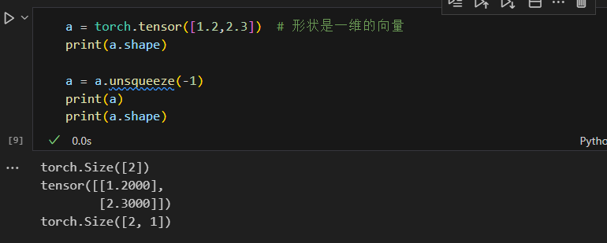
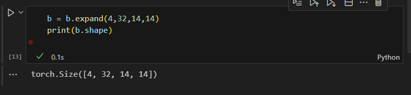

# 维度变换

## View操作

**将一个四维的张量（b x c x h x w）转换成一个二维的张量**
  

**对于四张图片 将每一张图像用一行向量进行表示，忽略通道信息**

## unSqueeze操作

**增加一个维度，在指定索引位置添加维度吗，不会改变数据本身，相当于新增加一个组别**
  

  

## 图片处理的一个案例

**bias相当于给每一个channel上的所有像素增加一个偏置**

**需要变换bias的维度**
  

## squeeze 维度删减操作

* b.squeeze() 删减所有维度为1

  

  

## 维度扩展-expand

**应用场景：四张32通道的14 x 14大小的图片，然后添加上偏置1,32,1,1 那么需要对偏置进行扩展**

  

  

## 维度扩展-repeat

**这种方法会主动复制内存数据，repeat的每一个参数表示复制数据多少次**

  

## 矩阵的转置操作-transpose

  

