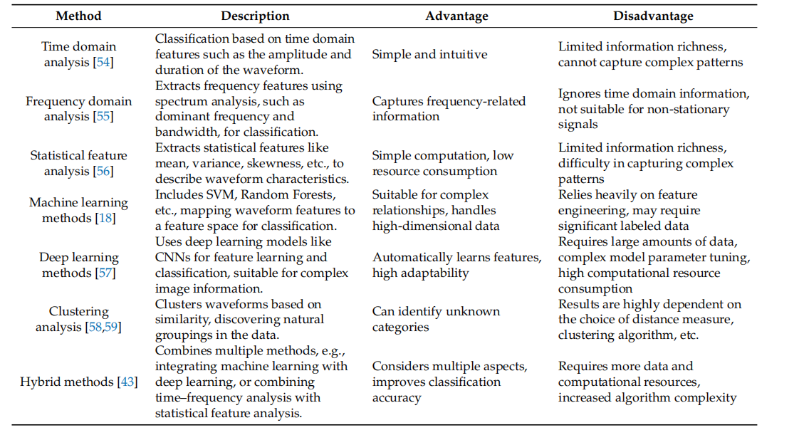
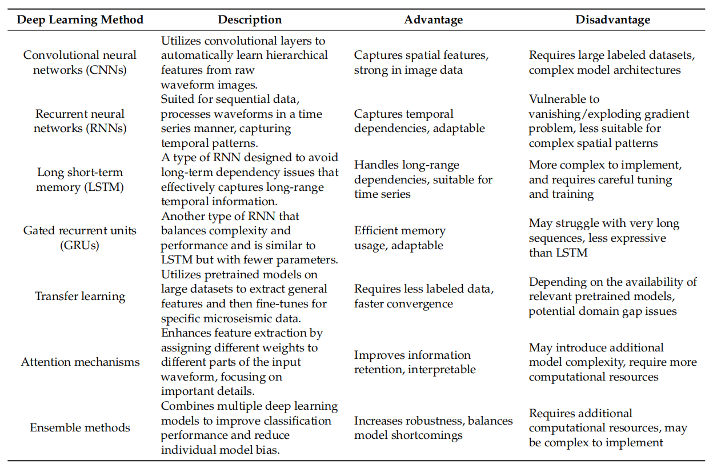

# 【微地震事件监测最新综述2023阅读笔记】Microseismic Monitoring Signal Waveform Recognition and Classification: Review of Contemporary Techniques

## 摘要

&emsp;这篇文章的摘要讨论了微地震事件识别的重要性，以增进我们对地下现象的理解并确保地质安全。文章采用文献综述的方法，总结了过去十年微地震信号识别方法和技术的研究进展。对常用识别方法的优势和局限性进行了系统分析和总结。文章还广泛讨论了一些前沿的机器学习模型，如卷积神经网络（CNNs），以及它们在波形图像处理中的应用。这些模型展示了自动提取相关特征并实现精确事件分类的能力，超越了传统方法。在对现有研究进行基础上，文章对深度学习在微地震事件分析中的优势、劣势、机会和威胁（SWOT）进行了全面分析。强调了深度学习技术在微地震事件波形图像识别和分类方面的潜力，同时也承认了与数据可用性、资源需求和专业知识相关的未来挑战。随着机器学习的不断发展，深度学习与微地震分析的整合有望推动地质工程灾害监测和预警的进步。

## Introduction


&emsp;这段文字讨论了在当今矿业运营的景观中，正在进行一场深刻的转变，其特点是向智能矿业的过渡。这种范式转变得以实现，得益于先进技术的整合，如物联网（IoT）、大数据分析和人工智能（AI）。这一转变的核心是不断提升矿业安全的承诺。随着矿业活动深入地壳，岩石层稳定性越来越容易受到由人类活动引起的干扰的影响。这些干扰导致地质灾害，如岩爆和矿业诱发的地震事件，对矿工的安全和矿业生产的效率构成严重威胁。在这一背景下，微地震监测技术已经成为确保矿业运营地质安全的基本支柱。

&emsp;在这段文字中，提到了智能矿业的转变，这是通过整合物联网、大数据分析和人工智能等先进技术来实现的。这种转变的核心目标是提高矿业安全水平。随着矿业活动的深入，岩石层的稳定性变得更容易受到人为活动的干扰，从而引发地质灾害，如岩爆和矿业诱发的地震事件。这些灾害对矿工的安全和矿业生产的效率都构成了严重的威胁。在这一情境下，微地震监测技术被提到，并被认为是确保矿业运营地质安全的基本支柱


&emsp;这一段文字说明了微地震监测涉及在采矿活动过程中对微小地震事件进行持续监视。这些微小的地震事件虽然察觉不到，但提供了有关不断演变的地质条件的宝贵信息。它们作为早期预警信号，为潜在危险提供了重要的见解，并使及时的预防措施成为可能。这不仅保障了矿工的安全，还提高了采矿实践的整体效率和可持续性。除了在智能矿业中的实际价值和重要性之外，微地震监测技术在各个领域都得到了广泛应用。


```
审查背景： 作者指出，由于矿业环境的不断变化和对安全保障的需求，他们启动了对微地震事件识别和分类的现代技术的审查。这表明他们对当前矿业领域面临的挑战和问题感兴趣，并意识到需要先进的方法来解决这些问题。

对高级方法的需求： 文章强调了对先进方法的紧迫需求。这可能与传统方法在处理复杂的地下环境和地质条件时的局限性有关。因此，作者希望通过审查当代技术，找到更有效、智能的解决方案。

与智能矿业实践的契合： 作者提到，这项工作不仅满足对先进方法的迫切需求，还与更广泛的智能矿业实践趋势相契合。这表明他们的研究目标是与行业的整体发展方向相一致，以适应矿业领域的现代化趋势。

结合深度学习与微地震事件分析： 为了提供更全面的调查，作者计划将深度学习与微地震事件分析相结合。这表明他们关注新兴的人工智能技术，特别是深度学习，以改进微地震监测的准确性和效率。

服务于地质工程和计算机科学社区： 最后，作者强调他们的工作旨在为地质工程和计算机科学社区提供全面的调查，使他们能够充分利用基于人工智能的微地震监测的潜力。这显示了他们的目标是在学术和应用领域产生实质性的影响。

```

* 岩石断裂产生的微地震信号： 文中指出，地震事件、地质灾害和地下挖掘过程中岩石团块的断裂会产生大量的微地震信号。这些微地震信号是岩石质量变化的指示器。

* 微地震监测系统： 深层地下工程中使用的微地震监测系统（MMS）能够实时收集大量的波形数据。这说明在深度地下工程中，微地震监测是一种重要的技术手段，用于监测岩石的状态变化。

* 噪音信号的挑战： 文章提到了一种挑战，即某些欺骗性的噪音信号与微裂纹信号具有显著的相似性，需要工程师在不同领域的信号特征之间进行交叉参考。这种挑战使得迅速且准确地检测微地震数据变得困难。

* 噪音信号对检测的影响： 特别值得注意的是，与微地震信号密切相似的噪音信号的存在显著阻碍了快速而准确的检测，从而削弱了有效的地质灾害评估和风险预防。


```
深度学习和图像识别在微地震监测中的缺失： 作者指出，虽然已经有多个研究探讨了机器学习在微地震监测中的应用，但深度学习和图像识别的综合研究尚未完全展开。他们通过这项研究来填补这一空白，并进行有针对性的研究。

研究目标： 作者的目标是探讨在微地震事件波形图像检测和分类中使用深度学习的复杂性，以深入了解其潜力和局限性。这表明他们关注了在微地震监测中应用深度学习所涉及的技术和方法的详细研究。

研究的意义： 文中强调了这项工作的重要性，因为它专注于对深度学习在微地震监测中的前沿应用的调查。通过对可用方法的全面概述和对图像识别的深入研究，他们提供了这一领域强项和局限性的比较研究。

对受众的价值： 该研究被描述为对地质工程和地球科学领域的研究人员、从业者和利益相关者的重要参考。它为未来地质灾害预测和监测的进步奠定了基础，最终提高了采矿活动中的安全性。

深度学习的未来应用： 最后，文中指出，随着深度学习的不断发展，将其与微地震分析无缝集成有望提供有价值的见解和实际应用，加强采矿活动中的地质安全。

```

## 2. Materials and Methods

### 2.1. Microseismic Monitoring Signals

* 监测系统使用传感器捕获这些信号，并将它们传输到地表或数据中心进行进一步的分析。这些信号在波形、振幅、频率等方面具有独特的特征，这些特征可用于识别各种类型的微地震事件，并为矿山安全提供必要的信息和警告。

* 挑战： 作者指出，区分这些信号的挑战在于它们的波形相似性。由于波形相似，准确地识别真实的微地震信号是一个具有挑战性的问题。

* 解决方法： 学者们已经广泛研究了这个问题，以实现对监测系统内真实微地震信号的准确识别。通过研究地震数据分析方法，一些常用于评估易燃矿井中地震活动的方法，因地震探测器布局不利而遇到了局部化错误和不完整数据目录的挑战。


* 时间和空间的信号强度变化： 微地震监测数据表现出随时间和空间变化的信号强度变化，这可能是由于地下岩石形态和采矿活动的复杂变化。这意味着微地震数据能够提供关于地下活动的丰富信息。

* 噪音水平的提高： 机械过程、设备故障、地下水运动或环境条件的变化等因素可能导致微地震数据中噪音水平的提高。这使得数据处理变得复杂，因为需要对信号和噪音进行清晰的区分。

* 复杂和多样的波形： 由于地质效应，微地震数据的波形通常是复杂且多样的，反映了岩石的物理特性以及地下结构的差异。这增加了对数据的处理和分析的挑战。

* 频率和能量水平的广泛变化： 微地震数据涵盖了广泛的频率和能量水平范围，这意味着微地震可以在各种频率和能量水平中表现出来。这种变化性使得事件的识别和分类变得困难，需要对各种特征进行调查和处理。

&emsp;微地震监测数据的复杂性： 文中指出，这些微地震监测数据的特征反映了底层岩石和采矿活动的复杂性。这需要先进的数据分析技术来进行解释和理解。

&emsp;信号强度随时间和空间的变化： 信号强度随时间和空间的变化表明微地震事件的分布是不均匀的，这可能与地下岩层或采矿活动的不均匀性有关。这强调了需要针对这种非均匀性进行数据分析的需求。

&emsp;噪音水平的处理： 为了在高噪音水平下改善微地震事件的检测和分析，需要进行预处理措施，如模糊和滤波。

&emsp;复杂波形的重要性： 复杂的波形可能反映出各种地下结构，这对于识别各种类型的事件，如岩爆、爆破和微裂纹，非常重要。

&emsp;频率和能量水平的多样性： 由于频率和能量水平的多样性，必须采用多尺度和多特征分析方法，以捕捉微地震信号的多个属性。这强调了在处理微地震监测数据时需要考虑多方面的数据特性。


```
波形图像的多样性： 通过提到不同类型的微地震事件波形图像，文中强调了这些事件在波形上呈现出多样性。这种多样性反映了不同事件在波形上的独特特征。

特征提取的重要性： 为了对微地震事件进行全面的分析和分类，研究人员可以使用特征提取方法，这有助于从波形图像中提取出关键特征。这些特征提取的方法可能包括对振幅、频率、时域和频域等方面的分析。

图像展示不同事件类型： 图3展示了岩石微裂事件、爆破事件、岩石钻进事件、电力干扰事件等不同类型的微地震事件波形图像。这提供了一个视觉上的展示，有助于理解这些事件在波形上的差异。

对微地震事件的理解： 通过波形图像的分析，可以更好地理解和区分各种类型的微地震事件。这对于深入了解地下活动的性质以及在不同条件下发生的事件类型具有重要意义。

```

```
自然发生的微地震事件： 由地下结构运动和岩石变形等自然过程触发的微地震事件。

人为引起的微地震事件： 由矿业活动、爆破等人类活动引起的微地震事件。

岩爆事件： 由岩石的破裂或坍塌引起的微地震事件。

```

* 特征提取的重要性： 文中强调了从波形图像中提取特征的重要性。这些特征能够在时间和频率域中对微地震事件进行表征，为后续的分析提供了基础。

* 特征的种类： 提到的特征包括振幅、频率、能量分布、波形形状等。这些特征能够提供有关微地震事件不同方面的信息。

* 建立识别和分类模型： 通过对特征进行定量分析，研究人员可以建立模型，用于微地震事件的识别和分类。这些模型有助于更精确地理解和响应潜在的地下活动。

* 提高监测系统的准确性： 所建立的模型可以帮助提高矿业和地下工程监测系统对潜在微地震事件的准确识别和响应，从而增强地下操作的安全性和可持续性。

* 图3的视觉参考： 引用了图3作为一个视觉参考，突出了波形图像的多样性，强调了从这些图像中进行特征提取的必要性。


### 方法

* 方法学的多样性： 文中提到的表格突显了在微地震事件识别中采用的方法学的多样性，涵盖了从传统方法（如EEMD）到机器学习方法（如DT、SVM和CNN）的整个谱系。这种多样性为研究人员提供了基于其具体需求选择的广泛工具。

* 传统方法和机器学习方法的涵盖： 文中提到了传统方法，例如EEMD和SSA，以及机器学习方法，如DT（Decision Trees）、SVM（Support Vector Machines）和CNN（Convolutional Neural Networks

* 性能指标的重要性： 文中指出了性能指标的关键性。报告的分类准确率等指标提供了对某些方法有效性的定量度量。这对于寻求高性能模型进行微地震波形分类的研究人员来说至关重要。

* CNN 的分类准确率： 提到了 CNN 达到的约 99% 的分类准确率。这表明 CNN 在微地震波形分类方面取得了很高的性能，为该方法的可行性提供了量化支持。

* 数据预处理的重要性： 文中强调了数据预处理的重要性，包括噪声减少和滤波等步骤。这表明在应用识别模型之前，确保数据质量是至关重要的。

* 时间和工作量的挑战： 提到了在 Lin 等人的研究中提到的数据预处理需要的时间和工作量。这突显了在确保在应用识别模型之前数据质量方面所面临的挑战。

* 更大数据集的重要性： 文中指出了对更大和更多样化的训练数据集的需求，以提高模型性能的稳健性。

* 研究的例子： 以 Yi 等人的研究为例，强调了量化其方法的稳健性的需要，并指出数据集的规模可能是潜在的限制因素。

* 迁移学习的成功： 文中强调了迁移学习在微地震事件识别中的成功，特别是 Dong 等人的研究成果。在这个研究中，预训练模型（如AlexNet和GoogLeNet）的性能超越了传统的SVM分类器。

* 利用现有知识的重要性： 这表明在微地震事件识别中，利用预训练模型中的现有知识可能是一种强大的策略。这意味着先前在其他领域训练过的模型可能具有一定的泛化性，可以在微地震事件识别中取得良好的性能。

* 深度学习方法的强大性和需求： 文中指出，深度学习方法虽然强大，但对大量标记数据和计算资源的需求较大。这表明深度学习在某些情况下可能需要庞大的数据集和高性能的计算设备。

* 稳定性评估： 这一方面通常包括使用技术，如交叉验证、重复实验或引入噪声数据，以评估模型在不同条件下的一致性和稳定性。这有助于了解模型在不同情况下的表现是否一致和稳定。

* 稳健性测试： 这一方面通常包括使用对抗性样本来测试模型对干扰和扰动的响应。此外，引入输入数据的变化，如缩放、旋转或平移，可以用于评估模型的稳健性。

* 增强模型稳健性的方法： 文中提到了一些增强模型稳健性的方法，包括使用数据增强技术扩展训练数据集，应用正则化方法降低过拟合的风险，以及使用集成学习方法获得更稳定和稳健的预测。

* 频谱分析方法的适用性： 文中指出，频谱分析方法适用于提取频域特征，但可能忽略时间信息。

* 统计方法的优势： 统计方法在处理微地震波形时提供丰富的数据分布信息，但在分类复杂波形时可能面临挑战。

* 传统机器学习方法的性能： 传统机器学习方法（如逻辑回归）在特定背景下表现良好，但需要手动进行特征工程。

* 深度学习方法的优势和挑战： 相比之下，深度学习方法具有强大的自动特征学习能力，使其能够适应多样化的波形。然而，深度学习方法需要大量标记数据和计算资源。

## 2.3. Identification Methods

### 2.3.1. Statistical Analysis and Spectral Analysis


* 统计分析方法： 统计分析方法旨在通过定量分析微地震事件波形数据中的特定属性来提取有意义的信息。在统计方法中，研究人员通常关注信号的统计分布、均值、方差等统计特征，以区分不同类型的微地震事件。

* 频谱分析方法： 频谱分析方法强调信号的频率特征，如频谱密度和功率谱密度，以区分微地震事件的频域特征。这种方法关注波形在频率上的特性。

* 方法特点： 尽管这些技术简单而直观，但它们通常需要仔细的选择和特征提取。在处理复杂和多样化的波形时，这可能会变得繁琐。

```
均值和标准差： 计算微地震信号的平均值和标准差提供了关于信号整体水平和变异性的信息。

相关性分析： 通过计算微地震信号之间的相关系数或相关矩阵，揭示信号之间的相互关系，有助于确定它们的相似性或相关性。

概率分布分析： 分析微地震信号的概率分布，如正态分布、指数分布等，可以提供关于不同范围内的分布特征的见解，便于分类和区分。

统计特征提取： 提取微地震信号的统计特征，如峭度、偏度、能量等，可以捕捉信号的特定统计模式，有助于识别和分类。

假设检验： 利用统计假设检验方法（如 t 检验、方差分析等）比较不同类别的微地震信号，检查它们之间是否存在显著差异。

聚类分析： 应用聚类分析方法根据特征对微地震信号进行分组，从而实现波形的分类和识别。

```
```
傅里叶变换： 傅里叶变换是频谱分析的基础，将信号从时域转换到频域，表示为频率和幅度的函数。

功率谱密度： 功率谱密度描述信号在不同频率上的能量分布，可以通过傅里叶变换获得。它显示信号在不同频段的强度或能量分布，有助于识别信号的频率成分。

快速傅里叶变换（FFT）： FFT通常用于高效计算信号频谱。它允许对离散信号的频率谱进行快速计算，提高了计算效率。

频谱图： 频谱图是信号频谱的视觉表示，其中频率位于水平轴上，振幅或能量位于垂直轴上。它直观地显示了信号的频率成分和能量分布，有助于观察频谱特征。

频带能量特征： 通过将频谱分成不同的频率带并计算每个频带中的能量或功率，可以提取频带能量特征。这些特征反映了信号在不同频率范围内的强度或能量分布，有助于识别和分类不同类型的微地震信号。

```

```
手动识别方法： 手动识别方法通常依赖领域专家的专业知识和直觉，通过手动选择和提取波形特征来判断事件类型。

传统机器学习方法： 传统机器学习方法通过训练模型学习不同事件类型的特征，然后对新的波形数据进行分类，从而自动化了这个过程。然而，这些方法在某些情况下表现良好，但仍然依赖手动设计的特征，这可能在复杂波形的分类和识别中存在局限性。

深度学习方法： 深度学习作为新兴技术，具有强大的自动特征学习能力，可以直接从原始波形数据中提取特征，因此在微地震事件识别方面具有更大的潜力。

```


## 3.1. Classification of Methods

&emsp;根据现有研究，作者进一步总结了在微地震事件波形识别和分类领域使用的方法。具体而言，他们将这些方法分为七类：时域分析方法、频域分析方法、统计特征分析方法、机器学习方法、深度学习方法、聚类分析方法和混合方法。关于不同类型方法的优势和局限性的解释和分析呈现在表2中，旨在帮助读者更好地了解这些方法的特点和适用性。

  

&emsp;时间域分析侧重于信号的时间和波形特征的变化。通过观察信号的幅度、持续时间、周期性等特征，可以获取关于信号的直观认知和与时间相关的信息。这些信息对于微地震事件的识别和定位非常有用。常见的时间域分析方法包括波形图、包络分析、自相关函数和互相关函数。时间域分析方法适用于检测瞬态事件、脉冲信号和时间相关性。另一方面，频域分析关注信号的频率成分和谱特性。通过将信号转换为频域表示，可以分析信号的频率分布、频率成分和相应的能量分布。常见的频域分析方法包括傅立叶变换、功率谱密度和谱图。频域分析方法适用于分析信号的频率特性、频率成分之间的相互关系等。因此，时间域分析和频域分析是微地震信号处理中常用的两种方法。时间域分析侧重于信号的时间变化和波形特征，提供直观的时间相关信息，而频域分析侧重于信号的频率成分和能量分布，揭示信号的频率特性。这两种方法相互补充，共同提供了对信号的全面描述和理解，有助于识别微地震事件并研究它们的频率特性和时间相关性。

&emsp;统计特征分析涉及从信号中提取和计算各种统计特征。这些统计特征包括均值、标准差、峰值、能量等，可以通过分析信号的统计特性来表征整个信号。统计特征分析方法通常基于数学统计理论，计算速度快，不需要大量的训练样本。这些特征可以用于构建基于规则或阈值的分类模型。机器学习方法是一种数据驱动的方法，通过学习信号特征并使用训练模型进行分类。常见的机器学习方法包括支持向量机（SVM）、随机森林（RF）和朴素贝叶斯。这些方法通常需要手动设计特征，并使用提取的特征来训练分类模型。机器学习方法适用于中等规模的数据集和相对简单的问题，但在处理复杂的信号模式时可能存在局限性。另一方面，深度学习方法基于神经网络，可以通过多层网络自动学习特征和模式进行分类。深度学习方法的核心是人工神经网络（ANN），如卷积神经网络（CNN）和循环神经网络（RNN）。这些方法使用大规模的训练数据和反向传播算法优化网络权重，从而自动提取复杂的信号特征并进行高级分类。深度学习方法擅长处理大规模数据集和复杂问题。

&emsp;机器学习和深度学习方法的区别在于前者需要手动设计特征提取过程，并使用提取的特征来训练分类模型，而后者通过多层神经网络自动学习信号特征和模式，无需手动定义特征。深度学习方法通常需要更多的训练数据和计算资源，但它们可以处理更复杂的信号模式，并具有更强的泛化能力。因此，在微震信号识别和分类中，机器学习方法适用于中等规模的数据集和相对简单的问题，而深度学习方法适用于大规模数据集和复杂问题。研究人员可以根据数据集大小、问题复杂性和可用资源选择适当的方法。

## 3.2. SWOT Analysis of Deep Learning

```
优势 (Strengths):

自动学习特征： 深度学习方法能够自动从波形数据中学习复杂的模式和特征，无需手动设计特征提取过程。
分层抽象特征： 深度学习模型通过多层网络从波形数据中提取低级局部特征和高级全局特征，更准确地理解和表示波形的语义信息。
大规模数据训练： 深度学习通过大规模训练数据优化网络权重，对处理噪音和微震事件识别的波动性具有更强的鲁棒性。

劣势 (Weaknesses):

数据和计算资源需求： 深度学习方法通常需要大量标记的数据和大量计算资源进行训练，这可能对研究者的数据获取和计算设施造成一定压力。
模型训练时间： 由于深度学习方法涉及多层神经网络的训练，其训练时间相对较长，可能需要更多的时间来完成模型的训练过程。

```

```
对微小变化的敏感性： 深度学习在捕捉微震事件波形图像中的复杂模式和微小变化方面表现出色，能够实现对微震事件的精准识别和分类。例如，Huang等人 [61] 利用卷积神经网络（CNN）成功识别和定位微震事件。

特征提取： 深度学习技术能够有效地从波形图像中提取复杂的特征，从而增强对各种微震事件的区分能力。例如，Li等人 [15] 利用深度卷积神经网络（DCNN）在微震波形分类方面取得了高准确性。

可扩展性： 深度学习处理大规模数据集的能力与微震监测的数据密集性相符，从而提高了准确性。Wang等人 [47] 应用深度学习方法处理了大量微震波形数据，取得了良好的分类结果。

```

```
有限的标注数据： 微震波形数据标注有限可能阻碍模型的训练和验证，潜在地限制了算法的性能。例如，Wang等人 [47] 指出，当训练样本数量少于512时，分类准确性急剧下降。

资源需求： 复杂的深度学习模型可能需要大量计算资源，在资源有限的环境中可能面临挑战。例如，Dong等人 [51] 提到，训练深度卷积神经网络需要比传统分类方法更多的时间和计算资源。

专业知识需求： 实施和微调深度学习模型需要对微震领域知识和机器学习的专业知识。例如，Bi等人 [38] 演示了深度学习模型的参数调整和调试需要机器学习专业知识，而结果的可解释性也依赖于对微震领域的了解。

```


## 3.3. Comparison of Deep Learning Models

&emsp;深度学习方法在微震数据分析中发挥着关键作用。通过从波形数据中自动学习和提取特征，这些方法为地震学家和工程师提供了强大的工具，帮助他们了解地下结构和地震活动。然而，在选择适当的方法时，对不同深度学习方法的优势和劣势有清晰的了解是至关重要的。表格3提供了对几种常见深度学习方法的描述、优势和劣势的分析。从捕捉空间特征的CNN到处理时间依赖性的LSTM网络，每种方法都有其自己的特点和应用范围。此外，迁移学习、注意机制和集成方法已被引入，以进一步提升微震数据的分类性能和信息提取能力。对这些深度学习方法的全面评估可以帮助研究人员选择最适合其研究目标的方法，并推动微震数据分析领域的发展和创新。

  


&emsp;简而言之，在微地震监测中，机器学习与地球科学的整合受到大规模数据集的可用性、计算能力的进步、迁移学习和预训练模型、自动化工具以及跨学科合作等因素的推动。这些因素提高了模型性能，实现了高效的训练，降低了数据需求，促进了更广泛的应用，并推动了合作研究。这种整合对推进微地震监测能力具有巨大潜力。


## 挑战

(1) 实时性和准确性：实时识别和分类微地震事件面临重大挑战，特别是在处理大量数据时。模型必须在极短的时间内做出准确的决策，这需要在模型设计和计算效率方面进行改进。在实时要求、模型复杂性和计算需求之间取得平衡至关重要。

(2) 模型泛化到新事件：将模型泛化到新的事件类型是一个主要挑战，因为在训练过程中，模型通常只有对某些事件类别有限的接触。这需要进一步研究迁移学习和数据增强方法，以适应不断变化的监测环境。

(3) 模型可解释性：在微地震事件领域，模型的可解释性对于确保决策的透明性和可信度至关重要。目前，深度学习模型通常被认为是“黑盒”模型，很难解释其决策过程。因此，未来的研究应该专注于提高深度学习模型的可解释性。

(4) 数据不平衡：微地震事件数据往往存在类别不平衡的问题，即某些事件类别的样本较少。这可能导致少数类别的性能下降，并需要有针对性的解决方案，如过采样或生成对抗网络（GANs）。

(5) 可持续性和资源效率：深度学习模型通常需要大量的计算资源，这带来了可持续性和资源相关的挑战。因此，研究工作应该集中在提高模型资源效率方面，包括开发更节能的硬件和算法。


&emsp;基于前述的机遇和挑战，微地震监测领域可以通过以下方面进一步促进深度学习的发展和应用：(1) 数据处理和模型优化：为了解决有限标记数据的问题，可以探索半监督学习、主动学习和迁移学习等技术，减少对大量标记数据的依赖。这有助于提高模型性能和泛化能力。为了减轻噪声干扰，研究应该集中在噪声去除技术、波形恢复方法和数据增强策略上，以提高深度学习模型对噪声的鲁棒性。(2) 模型可解释性和可信度：在深度学习模型的开发中，应重点提高其可解释性。

&emsp;研究人员可以探索使用可解释的深度学习架构，引入注意机制，或采用可解释的模型来阐明决策过程。此外，建立模型的不确定性估计方法是关键的，因为它有助于评估模型输出的置信度，提供更可靠的决策支持。(3) 异构数据集和类别不平衡问题：可以采用过采样、欠采样和生成对抗网络等策略来解决这些挑战。这些方法有助于解决少数类别样本不足的问题，并提高模型在所有类别上的性能。(4) 模型部署和实时性能：为了应对实时性和准确性的挑战，研究应重点优化深度学习模型的推理速度和计算效率。可以探索模型压缩、量化和硬件加速等技术，以满足实时监测的需求。(5) 跨学科合作和知识整合：在面对挑战和机遇时，跨学科合作是至关重要的。与计算机科学、地震学、地质学、物理学等领域的专家合作，有助于知识的融合和交流，从而推动微地震监测领域的发展。

&emsp;未来的方向包括几个方面：首先，建立提高模型鲁棒性的策略，从而增强微震事件波形识别和分类模型的稳定性和可靠性。这可以通过使用更复杂的网络结构、引入正则化技术或整合多个模型来实现。其次，创建多样化的数据集至关重要。这些数据集应包含丰富的微震事件样本，涵盖各种地质环境和工作条件。使用多样化的数据集训练和评估模型可以提高其泛化能力和适应性。第三，数据增强技术可以有效地增加训练数据的多样性和数量，从而提高模型性能。例如，通过旋转、缩放和平移等操作进行数据增强，扩展数据集，使模型更好地适应微震事件之间的变化和差异。此外，在微震事件识别中使用深度学习中，探索迁移学习和自监督学习是一个有前途的研究方向。迁移学习可以利用现有的模型和知识，快速适应新的微震事件识别任务，从而提高模型性能和泛化能力。自监督学习可以使用适当的方法自动生成标签，利用无监督数据进行训练，进一步提高模型性能。通过持续的探索和改进，深度学习将为微震监测领域的采矿工程提供更可靠的安全保障。


